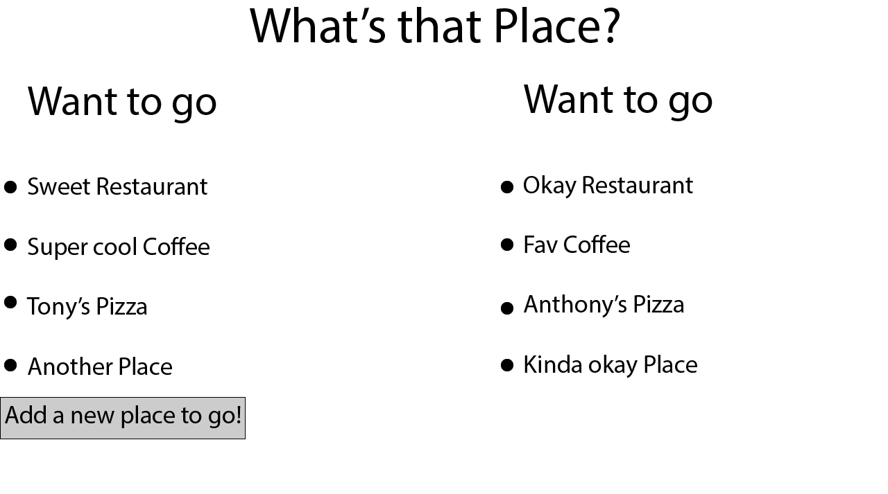
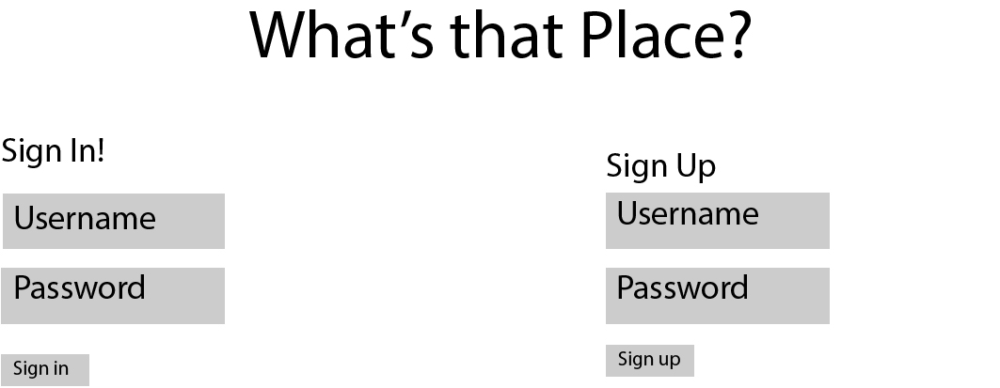
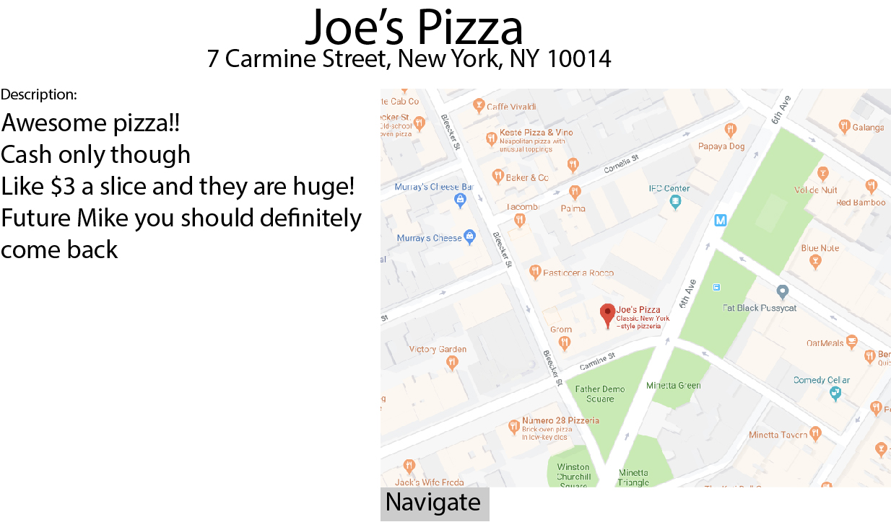
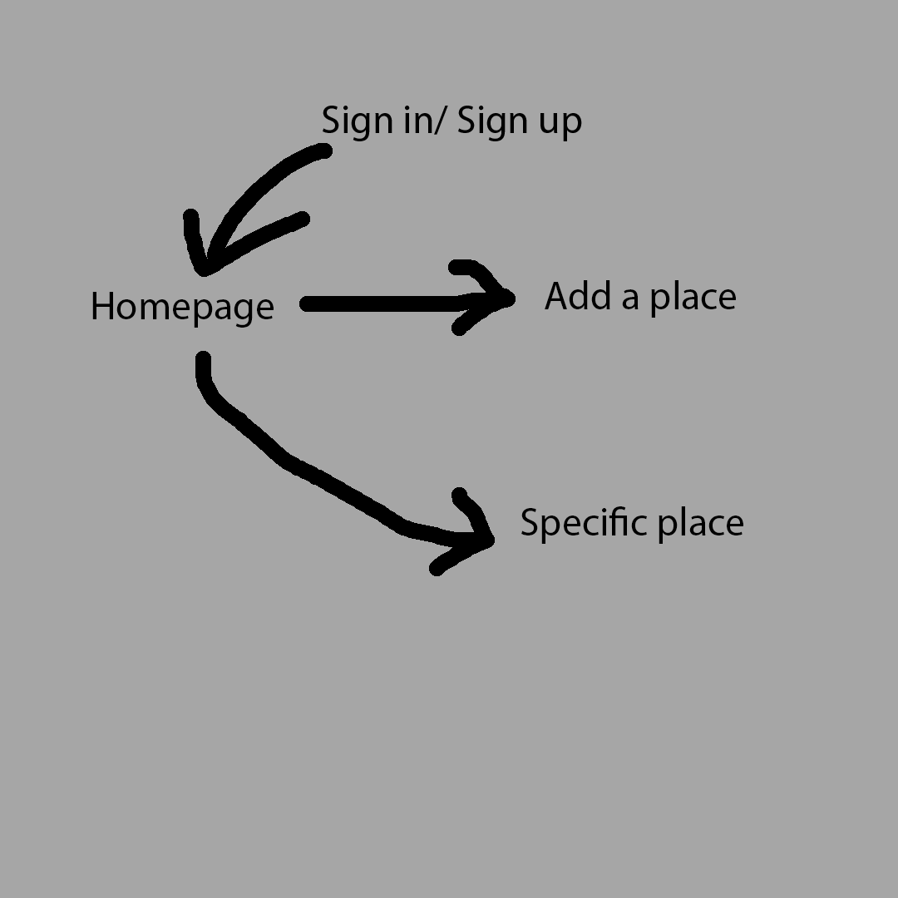

# What's that place?

## Overview

Finding where to eat your next meal is always a struggle, especially if you live in a big city with so many options, but we all walk by places that seem interesting and then forget about them ten minutes later or go somewhere and enjoy it but never go back. This web app is meant to mitagate that. It will let you aggregate all the places you see, have been to, or otherwise. 

The user will be able to sign in and see their lists of places that they've been to and enjoyed or places they thought seemed interesting but haven't been able to go to yet. At anytime the user can quickly come in and look through their lists of places or add a new place to any list they choose. They will also have a spot to write their own personalized description for themselves so future them will be able to more easily remember the place that they are looking at.

## Data Model

The application will store Users and lists of places.

* Users can have multiple lists of places based on whether they are new restaurants or ones they have previously been to.
* Each place will store it's name, location, and description as well as any other necessary information

An Example User:

```javascript
{
  username: 'Mike Anastasio'
  hash: //password hash,
  email: 'ma4976@nyu.edu',
  favoriteColor: 'blue'
  placesToGo: //array of restaurants they are looking to go to,
  placesBeen: //an array of restaurants they have already been to
}
```

An Example Place:

```javascript
{
  name: 'Sweet restaurant',
  description: 'Looked neat outside!',
  timePosted: '2018-11-07',
  address: '1 University Place, New York, NY 10003',
  hasBeen: false
}
```


## [Link to Commented First Draft Schema](/src/db.js) 

## Wireframes

/ - page with main views of all current list for a user when already signed in




/signin - page for sign in and sign up. The first page that will display if the user is not already signed in




/userSlug/placeSlug - page for showing all information about a specific place




## Site map



## User Stories or Use Cases

1. as non-registered user, I can register a new account with the site
2. as a user, I can log in to the site
3. as a user, I can create a new place to add to the list
4. as a user, I can view all of the lists of places on one page
5. as a user, I can move places from one list to the other
6. as a user, I can cross off places from my lists if I do not like the place
7. as a user, I can completely delete places from either list

## Research Topics

* (4 points) Integrate user authentication
    * I'm going to be using passport for user authentication
    * An account has been made for testing; I'll email you the password
    * see <code>/login</code> for login and create account page
* (2 points) Use bootstrap CSS Framework
    * To make app responsive and work well on phones because it is very suited to be used on a phone
* (2 points) Google Maps API
    * Google maps api to display the locations of different places as well as link to navigation
* May add more as development begins when necessary
8 total points

## [Link to Initial Main Project File](/src/app.js) 

## Annotations / References Used

1. [passport.js authentication docs](http://passportjs.org/docs)
2. [Bootstrap docs](http://getbootstrap.com/docs/4.1/getting-started/introduction/)